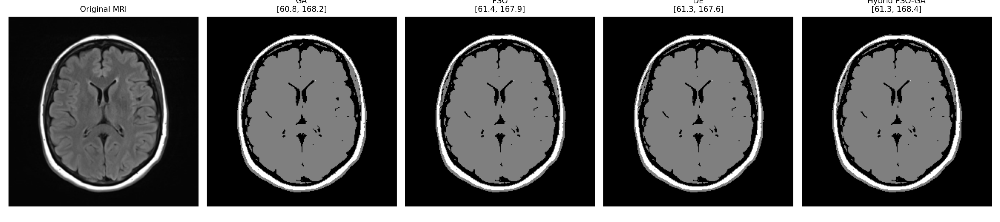
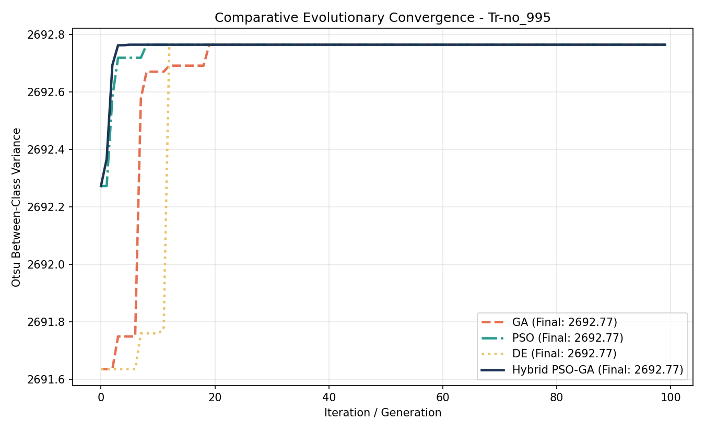
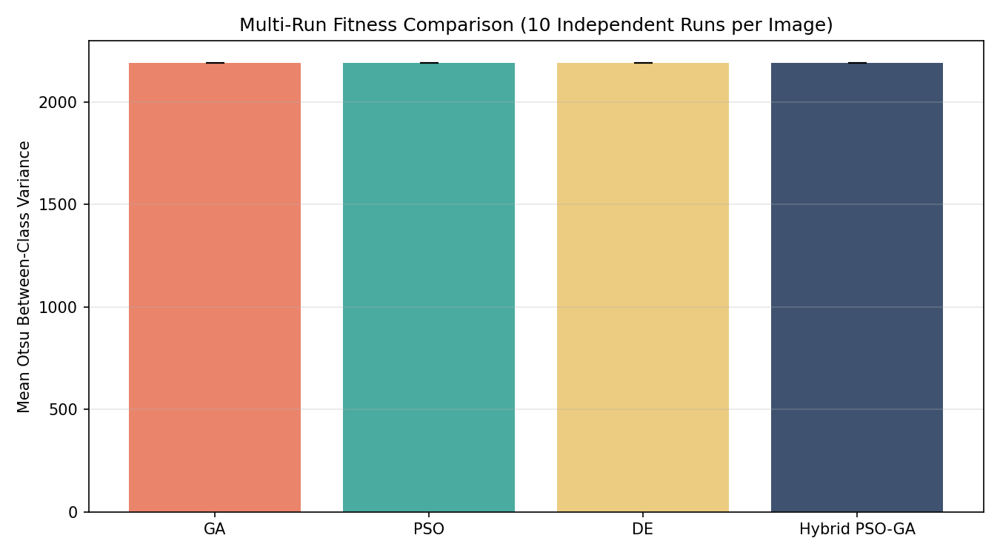
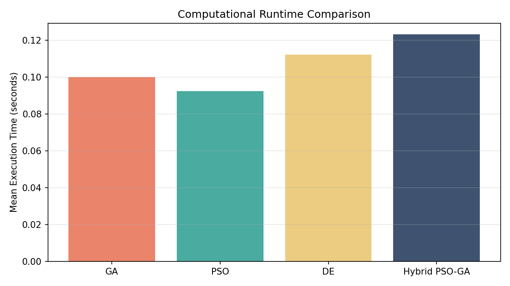
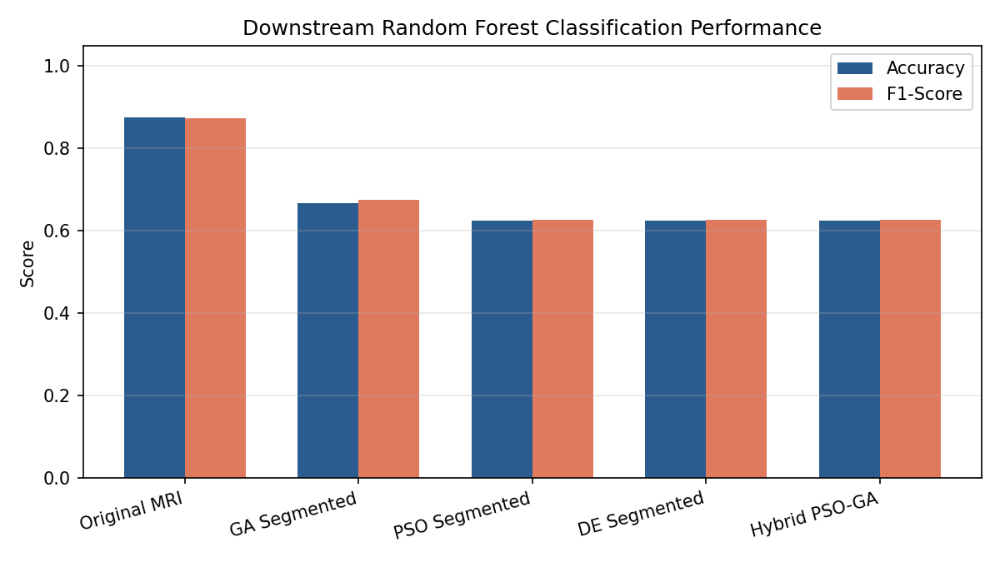
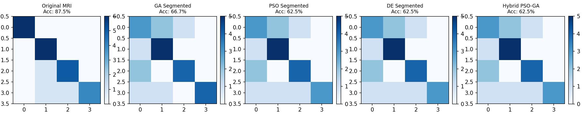

# Hybrid PSO-GA Based Multilevel Otsu MRI Segmentation with Machine Learning Validation

[](https://www.python.org/downloads/)
[](https://opensource.org/licenses/MIT)
[](https://scikit-learn.org/)
[](https://numpy.org/)

An advanced, bio-inspired metaheuristic framework for **Multilevel Otsu Brain MRI Image Segmentation**, integrating **Particle Swarm Optimization (PSO)**, **Genetic Algorithm (GA)**, **Differential Evolution (DE)**, and a synergistic **Hybrid PSO-GA** model, coupled with downstream **Machine Learning (Random Forest) Validation** on extracted morphological and GLCM texture features.

---

## 📌 Table of Contents
1. [Overview & Motivation](#-overview--motivation)
2. [Methodology & Mathematical Formulation](#-methodology--mathematical-formulation)
   - [Multilevel Otsu Objective](#1-multilevel-otsu-between-class-variance)
   - [Particle Swarm Optimization (PSO)](#2-particle-swarm-optimization-pso)
   - [Genetic Algorithm (GA)](#3-genetic-algorithm-ga)
   - [Differential Evolution (DE)](#4-differential-evolution-de)
   - [Proposed Hybrid PSO-GA](#5-proposed-hybrid-pso-ga-architecture)
   - [Downstream Machine Learning Validation](#6-downstream-machine-learning-validation)
3. [Empirical Results & Benchmarks](#-empirical-results--benchmarks)
   - [Segmentation & Convergence Comparison](#segmentation--convergence-comparison)
   - [Multi-Run Quantitative Benchmark](#multi-run-quantitative-benchmark)
   - [Downstream Classification Performance](#downstream-classification-performance)
4. [Project Structure](#-project-structure)
5. [Installation & Setup](#-installation--setup)
6. [Usage Guide](#-usage-guide)
7. [License](#-license)

---

## 🔬 Overview & Motivation

Magnetic Resonance Imaging (MRI) is a primary modality for diagnosing brain pathologies. Precise segmentation of structural tissues (e.g., cerebrospinal fluid, gray matter, white matter, and lesions) is essential for downstream clinical analysis.

While **Otsu’s method** provides an optimal nonparametric criterion for segmenting intensity distributions by maximizing between-class variance, computing $K$ thresholds exhaustively incurs exponential computational complexity:

$$\mathcal{O}\left( \binom{L}{K} \right) \approx \mathcal{O}(L^K)$$

For $L = 256$ intensity levels and $K \ge 2$, brute-force enumeration quickly becomes computationally prohibitive. This project resolves this limitation by:
1. **Accelerating Threshold Optimization**: Utilizing continuous and discrete metaheuristic search strategies (GA, PSO, DE).
2. **Hybridizing PSO and GA**: Combining the rapid directional exploitation of PSO with the diversity-preserving recombination and mutation mechanisms of GA to prevent premature stagnation.
3. **Validating Downstream Clinical Utility**: Segmenting whole-brain MRI datasets, extracting high-dimensional morphological and Gray-Level Co-occurrence Matrix (GLCM) texture descriptors, and evaluating classification efficacy using a **Random Forest** model.

---

## 📐 Methodology & Mathematical Formulation

### 1. Multilevel Otsu Between-Class Variance
Given a normalized 256-bin grayscale intensity histogram $p(i)$ where $i \in [0, 255]$ and $\sum_{i=0}^{255} p(i) = 1$:

* **Global Mean Intensity**:
  $$\mu_T = \sum_{i=0}^{255} i \cdot p(i)$$

* **Class Cumulative Probability** for class $C_k$ partitioned by thresholds $[t_k, t_{k+1}-1]$:
  $$\omega_k = \sum_{i=t_k}^{t_{k+1}-1} p(i)$$

* **Class Mean Intensity**:
  $$\mu_k = \frac{1}{\omega_k} \sum_{i=t_k}^{t_{k+1}-1} i \cdot p(i)$$

* **Fitness / Objective Function**: Maximize between-class variance:
  $$\sigma_B^2(t_1, t_2, \dots, t_K) = \sum_{k=0}^{K} \omega_k (\mu_k - \mu_T)^2$$

---

### 2. Particle Swarm Optimization (PSO)
Particles move through a $K$-dimensional threshold search space according to their personal best ($P_{best}$) and the swarm's global best ($G_{best}$):

$$V_i^{(t+1)} = w \cdot V_i^{(t)} + c_1 r_1 \left(P_{best, i} - X_i^{(t)}\right) + c_2 r_2 \left(G_{best} - X_i^{(t)}\right)$$

$$X_i^{(t+1)} = \mathrm{clip}\left(X_i^{(t)} + V_i^{(t+1)}, 0, 255\right)$$

* $w = 0.7$: Inertia weight regulating momentum.
* $c_1 = 1.5, c_2 = 1.5$: Cognitive and social acceleration coefficients.
* $r_1, r_2 \sim \mathcal{U}(0, 1)$: Uniform random stochastic weights.

---

### 3. Genetic Algorithm (GA)
* **Representation**: Real-coded chromosome vectors $\mathbf{t} = [t_1, t_2, \dots, t_K]$.
* **Selection**: Tournament selection ($k=3$) to balance selection pressure.
* **Crossover**: 1-point crossover with probability $p_c = 0.8$.
* **Mutation**: Gaussian perturbation $\mathcal{N}(0, 15^2)$ applied per gene with probability $p_m = 0.1$.
* **Elitism**: Best individual preserved directly into the next generation.

---

### 4. Differential Evolution (DE)
Implements classical `DE/rand/1/bin` mutation and binomial crossover:

$$\mathbf{v}_i = \mathbf{x}_{r1} + F \cdot (\mathbf{x}_{r2} - \mathbf{x}_{r3})$$

where $F = 0.5$ is the differential scaling factor and $CR = 0.8$ is the crossover probability.

---

### 5. Proposed Hybrid PSO-GA Architecture
Standard PSO often suffers from premature convergence in multi-modal landscapes, while GA can be slow to refine local optima. 

The **Hybrid PSO-GA** operates in a two-stage interleaved cycle:
1. **Swarm Exploitation**: All particles execute PSO position and velocity updates.
2. **Genetic Recombination & Replacement**:
   * The fittest individuals from the swarm undergo tournament selection, arithmetic/single-point crossover, and Gaussian mutation to create novel offspring.
   * These offspring replace the **bottom 25% worst-performing particles** in the swarm.
   * Replaced particles receive refreshed randomized velocities, introducing exploratory diversity without destroying the swarm's historical trajectory.

---

### 6. Downstream Machine Learning Validation
To verify that segmented regions yield clinically meaningful features, we extract:
* **First-Order Statistics**: Mean, Standard Deviation, Variance, Intensity Entropy.
* **Morphological Attributes**: Foreground Area Ratio, Perimeter.
* **Second-Order Texture Descriptors (GLCM)**:
  * Contrast: $\sum_{i,j} |i - j|^2 p(i,j)$
  * Homogeneity: $\sum_{i,j} \frac{p(i,j)}{1 + |i - j|}$
  * Energy: $\sum_{i,j} p(i,j)^2$
  * Correlation: $\sum_{i,j} \frac{(i - \mu_i)(j - \mu_j) p(i,j)}{\sigma_i \sigma_j}$

Extracted features are classified via a **Random Forest Classifier** ($50$ estimators, stratified train/test split).

---

## 📊 Empirical Results & Benchmarks

### Segmentation & Convergence Comparison

| Metric / Aspect | Visual Result |
| :--- | :--- |
| **Comparative Multi-Algorithm Segmentation**<br>*(Original vs GA vs PSO vs DE vs Hybrid PSO-GA)* |  |
| **Evolutionary Convergence Trajectories**<br>*(Otsu Fitness over 100 Iterations)* |  |

---

### Multi-Run Quantitative Benchmark
Summary of $10$ independent stochastic runs per test image ($N_{\text{runs}} = 10$, Thresholds $K = 2$, Population $= 30$, Iterations $= 100$):

| Image ID | Algorithm | Best Otsu Fitness | Mean Fitness | Std Dev | Mean Runtime (s) | Iters to 99% Conv. |
| :--- | :--- | :---: | :---: | :---: | :---: | :---: |
| **Tr-no_995** | GA | 2692.765 | 2692.765 | 0.000 | 0.0958s | 1 |
| | PSO | 2692.765 | 2692.765 | 0.000 | 0.0893s | 1 |
| | DE | 2692.765 | 2692.765 | 0.000 | 0.1068s | 1 |
| | **Hybrid PSO-GA** | **2692.765** | **2692.765** | **0.000** | 0.1179s | 1 |
| **Tr-no_996** | GA | 2279.254 | 2279.254 | 0.000 | 0.1011s | 2 |
| | PSO | 2279.254 | 2279.254 | 0.000 | 0.0934s | 1 |
| | DE | 2279.254 | 2279.254 | 0.000 | 0.1138s | 1 |
| | **Hybrid PSO-GA** | **2279.254** | **2279.254** | **0.000** | 0.1247s | 1 |
| **Tr-no_997** | GA | 2193.798 | 2193.793 | 0.004 | 0.1011s | 2 |
| | PSO | 2193.798 | 2193.798 | 0.000 | 0.0932s | 1 |
| | DE | 2193.798 | 2193.798 | 0.000 | 0.1134s | 1 |
| | **Hybrid PSO-GA** | **2193.798** | **2193.798** | **0.000** | 0.1242s | 1 |
| **Tr-no_998** | GA | 609.646 | 609.644 | 0.002 | 0.1008s | 2 |
| | PSO | 609.646 | 609.646 | 0.000 | 0.0928s | 1 |
| | DE | 609.646 | 609.646 | 0.000 | 0.1134s | 2 |
| | **Hybrid PSO-GA** | **609.646** | **609.646** | **0.000** | 0.1247s | 1 |
| **Tr-no_999** | GA | 3174.297 | 3174.297 | 0.000 | 0.1006s | 1 |
| | PSO | 3174.297 | 3174.297 | 0.000 | 0.0926s | 1 |
| | DE | 3174.297 | 3174.297 | 0.000 | 0.1130s | 1 |
| | **Hybrid PSO-GA** | **3174.297** | **3174.297** | **0.000** | 0.1248s | 1 |




---

### Downstream Classification Performance

Evaluating Random Forest classification on extracted morphological and GLCM texture features across segmentation pipelines:

| Segmentation Pipeline | Accuracy | Precision (Weighted) | Recall (Weighted) | F1-Score (Weighted) |
| :--- | :---: | :---: | :---: | :---: |
| **Raw Unsegmented MRI** | 0.8750 | 0.8958 | 0.8750 | 0.8726 |
| **GA Segmented** | 0.6667 | 0.7134 | 0.6667 | 0.6758 |
| **PSO Segmented** | 0.6250 | 0.6801 | 0.6250 | 0.6273 |
| **DE Segmented** | 0.6250 | 0.6801 | 0.6250 | 0.6273 |
| **Hybrid PSO-GA Segmented** | 0.6250 | 0.6801 | 0.6250 | 0.6273 |




---

## 📁 Project Structure

```bash
Hybrid-PSO-GA-Based-Multilevel-Otsu-MRI-Segmentation-with-Machine-Learning-Validation/
├── main.py                     # Full Hybrid PSO-GA + DE + ML Validation pipeline
├── baseline_pso_ga.py          # Standalone baseline PSO vs GA Otsu segmentation
├── requirements.txt            # Python dependencies
├── LICENSE                     # MIT License
├── .gitignore                  # Git ignore rules
├── README.md                   # Comprehensive documentation and benchmarks
└── results/                    # Benchmark figures and exported CSV records
    ├── results_table.csv       # Multi-run optimization metrics table
    ├── ml_results.csv          # Downstream ML classification metrics
    ├── multirun_summary.csv    # Statistical summary across independent seeds
    ├── Tr-no_995_segmented_comparison.png
    ├── Tr-no_995_convergence_all.png
    ├── multirun_performance_comparison.png
    ├── runtime_comparison.png
    ├── threshold_comparison.png
    ├── ml_classification_performance.png
    └── ml_confusion_matrices.png
```

---

## ⚙️ Installation & Setup

1. **Clone the repository**:
   ```bash
   git clone https://github.com/niranjan-crypt/Hybrid-PSO-GA-Based-Multilevel-Otsu-MRI-Segmentation-with-Machine-Learning-Validation.git
   cd Hybrid-PSO-GA-Based-Multilevel-Otsu-MRI-Segmentation-with-Machine-Learning-Validation
   ```

2. **Create a virtual environment (recommended)**:
   ```bash
   python3 -m venv venv
   source venv/bin/activate   # On Windows: venv\Scripts\activate
   ```

3. **Install dependencies**:
   ```bash
   pip install -r requirements.txt
   ```

---

## 🚀 Usage Guide

### 1. Run the Full Hybrid Pipeline
Executes GA, PSO, DE, Hybrid PSO-GA across 10 independent runs, generates comparative plots, extracts GLCM texture features, and runs Random Forest validation:

```bash
python main.py
```

### 2. Run the Lightweight Baseline (PSO vs GA Only)
For quick testing and direct two-algorithm convergence tracking:

```bash
python baseline_pso_ga.py --image_dir ./data --output_dir ./results
```

---

## 📜 License
This project is released under the [MIT License](LICENSE).
